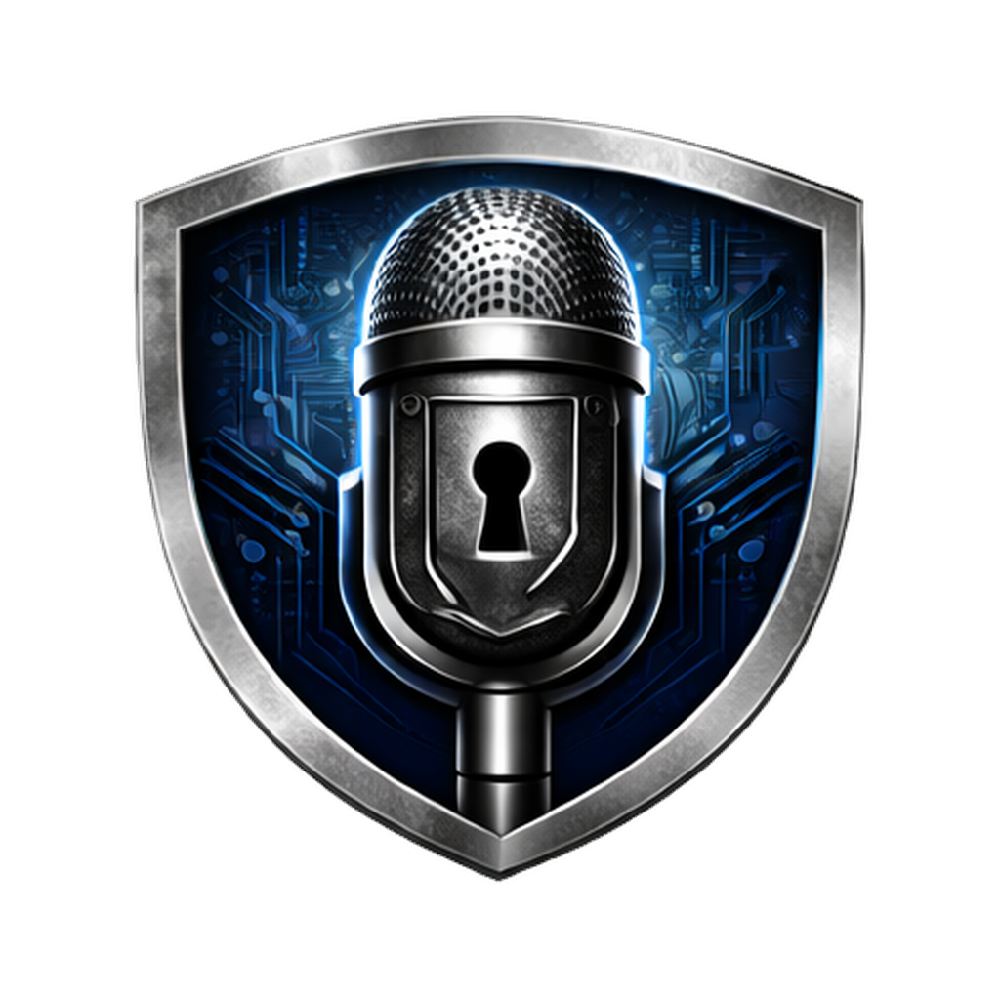

<p align="center">
  
</p>

<h1 align="center">IronMic</h1>

<p align="center">
  <strong>Fully-local voice transcription and text-to-speech.</strong><br/>
  Speak, transcribe, polish, listen back — all on-device. Zero network. Zero telemetry.
</p>

<p align="center">
  <a href="https://github.com/greenpioneersolutions/IronMic/releases/latest">Download</a> &middot;
  <a href="#features">Features</a> &middot;
  <a href="#quick-start">Quick Start</a> &middot;
  <a href="SECURITY.md">Security</a> &middot;
  <a href="AUDIT.md">Audit</a> &middot;
  <a href="LICENSE">MIT License</a>
</p>

---

IronMic captures your voice, transcribes it with Whisper, optionally polishes it with a local LLM, and copies the result to your clipboard or saves it as a rich-text note. A built-in TTS engine can read your dictations back to you. Everything runs entirely on your machine — no audio or text ever leaves the device.

---

## Features

### Core Dictation
- **Voice-to-clipboard** — Press a global hotkey, speak, press again. Polished text lands in your clipboard, ready to paste anywhere.
- **Voice-to-note** — Dictate directly into a rich text editor (TipTap/ProseMirror) with formatting, headings, lists, code blocks, and more.
- **Moonshine Base (default)** — Ships bundled with the installer (~146 MB). Transcription starts on first launch — no download required. 16× faster than Whisper Tiny on short speech with better WER.
- **Whisper large-v3-turbo** — State-of-the-art local speech recognition for multilingual or high-accuracy use cases. Downloadable from Settings.
- **LLM text cleanup** — A local Mistral 7B model removes filler words, fixes grammar, and preserves your meaning. Toggleable per-entry.
- **Custom dictionary** — Add domain-specific terms, names, and jargon to improve transcription accuracy.
- **Streaming transcription** — Partial tokens stream into the editor in real-time as you speak. No waiting for silence.

### Forge Mode — Dictate Into Any App <sup>NEW in 1.7.0</sup>

IronMic Forge is a Wispr-Flow-style floating bar that lets you dictate text directly into **any desktop application** — Outlook, Teams, Chrome, VS Code, terminal, native Notes, spreadsheets — without switching windows.

- **Always-on-top, non-focusable** — Target app keeps the keyboard caret. Your text appears exactly where the cursor is.
- **Push-to-talk** — Hold ⌥ Option (macOS) or Ctrl+Win (Windows) to record. Release to transcribe and paste instantly.
- **Hands-free toggle** — ⌥+Space (macOS) / Ctrl+Win+Space (Windows) toggles recording on/off.
- **Live transcript preview** — Committed words appear at full contrast; the live hypothesis streams in italic at reduced opacity — same visual language as Apple's dictation widget.
- **Platform-native paste** — macOS uses `System Events keystroke v`; Windows uses `WScript.Shell.SendKeys`. Fallback to Rust `enigo` for Linux and edge cases.
- **Token-cancellable clipboard restore** — Prior clipboard content is restored ~500 ms after paste (text-only).
- **Micro-bundle** — The Forge window is a separate Vite entry (~3.66 KB gz) with no TipTap, no charts, no AI chat — keeps the bar instant to open.
- **Shared Rust engine** — Forge and the main window share the same audio capture and Moonshine/Whisper model. No duplicate loading.

### Text-to-Speech Read-Back
- **Kokoro 82M TTS** — Hear your dictations read back through a local neural voice engine.
- **15 English voices** — American and British accents, male and female. Preview and switch in Settings.
- **Speed control** — 0.5x to 2.0x playback speed.
- **Word-level highlighting** — Words highlight in sync as they're spoken (karaoke-style).
- **Auto read-back** — Optionally read text aloud automatically after dictation completes.

### AI Assistant
- **Built-in AI chat** — Wrapper around GitHub Copilot CLI and Claude Code CLI.
- **Context-aware** — Ask questions, refine text, brainstorm — powered by your existing AI subscriptions.
- **Streaming responses** — Real-time token-by-token output.
- **Voice dictation in chat** — The mic button in the chat panel uses the same streaming Moonshine path as Forge and Notes. Raw transcript streams directly into the input field (no LLM polish, no dictionary correction) so you always review before sending.
- **Privacy-first** — The AI feature is off by default. When enabled, it uses your own CLI tools and credentials.

### On-Device Machine Learning <sup>NEW in 1.1.0</sup>

IronMic includes 5 TensorFlow.js-powered ML features that learn from your usage patterns — entirely on-device.

- **Voice Activity Detection** — Filters silence and noise before Whisper, making transcription faster. Configurable sensitivity.
- **Turn Detection** — Detects when you're done speaking. Three modes: push-to-talk, auto-detect (default 3s silence), and always-listening. Enables hands-free conversation loops with the AI assistant.
- **Voice Commands** — Say "search for meeting notes", "open analytics", or "summarize today" — IronMic classifies the intent and executes the action. LLM fallback for complex commands. Voice correction: "no, I meant...".
- **Context-Aware Routing** — Voice input automatically routes to dictation, AI conversation, or command classification based on your active screen. No manual mode switching.
- **Ambient Meeting Mode** — Leave IronMic running during a meeting. It transcribes with speaker awareness, detects when the meeting ends, and generates a summary with action items.
- **Semantic Search** — Search by meaning, not just keywords. "Find everything about the auth redesign" returns semantically related entries across all content.
- **Smart Notifications** — Learns which notifications matter to you and ranks them by predicted importance. Starts with heuristics, improves over time.
- **Workflow Discovery** — Detects repeating action patterns (e.g., "You check GitHub PRs, then update Jira, then dictate a status update every Thursday at 2 PM") and suggests automations.

> All ML models are under 50MB total. All training data stays in SQLite on your machine. Toggle each feature independently in **Settings > Voice AI**.

### Organization & Search
- **Timeline view** — Scrollable card feed of all dictations, newest first.
- **Full-text search** — Instant search across all transcriptions (SQLite FTS5).
- **Semantic search** — AI-powered meaning-based search across all content (TF.js Universal Sentence Encoder).
- **Tags** — Categorize entries with custom tags.
- **Pin & archive** — Pin important entries to the top, archive old ones.
- **Raw vs. polished toggle** — Switch between original transcript and LLM-cleaned version on any entry.
- **Auto-cleanup** — Configure automatic deletion of entries older than N days.

### Analytics <sup>NEW in 1.0.15</sup>
- **Dashboard** — Daily word counts, recording time, words per minute, streaks.
- **Topic classification** — LLM-powered topic tagging with trend charts.
- **Vocabulary richness** — Type-Token Ratio and unique word tracking.
- **Productivity comparison** — Period-over-period metrics.

### Model Management
- **In-app downloads** — Download Whisper, LLM, and TTS models directly from Settings.
- **Manual model import** — If downloads are blocked by a corporate proxy, download models in your browser and import them into IronMic with a file picker. The app validates and copies them to the right location.
- **HTTP proxy support** — Configure a proxy in Settings > Security for corporate networks (HTTP/HTTPS/SOCKS5).
- **Multiple Whisper sizes** — Switch between tiny, base, small, medium, and large models.
- **GPU acceleration** — Detect and enable Metal (macOS) or CUDA for faster inference.
- **Progress tracking** — Download progress bars with percentage indicators.

### Design & Customization
- **Dark / Light / System theme** — Full theme support with auto mode that follows your OS preference.
- **Configurable hotkey** — Visual key recorder with conflict detection.
- **Rich text editor** — Bold, italic, headings, lists, blockquotes, code, highlights, and more.
- **Enterprise design system** — Clean, professional UI built on Inter font with the IronMic blue accent.

---

## Architecture

```
Electron UI ← IPC (contextBridge) → Rust Core (napi-rs)
  ├── Main window (React 18 + Zustand)   ├── Audio capture (cpal)
  ├── Forge bar (forge-main.tsx)         ├── Moonshine ONNX (default STT)
  ├── TF.js ML Web Worker               ├── Whisper.cpp (optional STT)
  │   ├── VAD (Silero)                   ├── llama.cpp (text cleanup)
  │   ├── Intent classifier              ├── Kokoro ONNX (text-to-speech)
  │   ├── Semantic search (USE)          ├── Audio playback (cpal)
  │   ├── Notification ranker            ├── SQLite (storage + FTS5)
  │   └── Workflow predictor             ├── Clipboard (arboard)
  ├── uiohook-napi (Forge keyboard)      └── enigo (Forge paste, Linux)
  └── Web Audio API (AudioWorklet)
```

| Layer | Tech | Purpose |
|-------|------|---------|
| UI | Electron + React 18 + Tailwind CSS + Zustand | Desktop shell, component UI, state management |
| Forge bar | forge-main.tsx (separate Vite entry) | Always-on-top floating dictation bar, ~3.66 KB gz |
| Keyboard | uiohook-napi | Kernel-level push-to-talk / hands-free gesture detection |
| Editor | TipTap (ProseMirror) | Rich text editing |
| Bridge | napi-rs (N-API) | Typed Rust ↔ Node.js communication |
| Audio | cpal + Web Audio API | Cross-platform mic input, real-time VAD frames |
| STT (default) | ort (ONNX Runtime) + Moonshine Base | Fast local speech-to-text, bundled with installer |
| STT (optional) | whisper-rs (whisper.cpp) | Multilingual / high-accuracy speech-to-text |
| LLM | llama-cpp-rs (llama.cpp) | Local text cleanup |
| TTS | ort (ONNX Runtime) + Kokoro 82M | Local neural text-to-speech |
| ML | TensorFlow.js (Web Worker) | VAD, intent, search, notifications, workflows |
| Storage | rusqlite (SQLite + FTS5) | Entries, settings, ML data, embeddings |
| Clipboard | arboard | Cross-platform clipboard |
| Paste (Forge) | osascript / WScript / enigo | Platform-native paste-at-cursor |

---

## Prerequisites

- **Rust** stable (1.88+) + cargo
- **Node.js** 20+ + npm
- **CMake** (for whisper.cpp / llama.cpp compilation)
- **espeak-ng** (for TTS phonemization): `brew install espeak-ng`
- Platform-specific:
  - **macOS**: Xcode Command Line Tools
  - **Windows**: Visual Studio Build Tools (C++ workload)
  - **Linux**: `build-essential`, `libasound2-dev`, `libsqlite3-dev`

## Download

Pre-built packages are available on the **[Releases page](https://github.com/greenpioneersolutions/IronMic/releases/latest)**.

| Platform | Artifact |
|----------|----------|
| macOS (Apple Silicon) | `.dmg` |
| Windows | `.exe` installer |
| Linux | `.AppImage` |

**macOS note:** The app is ad-hoc signed (no Apple Developer ID), so Gatekeeper flags it as "unidentified developer." If you see **"IronMic is damaged and can't be opened"**, macOS has attached the `com.apple.quarantine` attribute to the downloaded DMG. Strip it before and after installing:

```bash
# Before opening the DMG:
xattr -cr ~/Downloads/IronMic-*.dmg

# After dragging IronMic into /Applications:
xattr -cr /Applications/IronMic.app
```

Then right-click IronMic → **Open** → **Open** on first launch to confirm.

The default speech recognition engine — **Moonshine Base** (~146 MB, English) — ships with the installer and is ready to use on first launch. No download required to start dictating.

If you need multilingual transcription, open **Settings > Models** to download a Whisper variant (Base/Small/Medium/Large). The Text Cleanup LLM (~4.4 GB, optional) is also downloaded from there. Use the **Open folder** button on that page to see exactly where models live on disk.

> Models run entirely on your machine. Nothing is sent externally.

---

## Quick Start (from source)

```bash
# Clone
git clone https://github.com/greenpioneersolutions/IronMic.git
cd IronMic

# One-command dev mode (builds Rust, installs deps, launches everything)
./scripts/dev.sh
```

The dev script:
1. Builds the Rust native addon with Metal GPU + TTS support
2. Installs npm dependencies (if needed)
3. Compiles Electron main & preload TypeScript
4. Launches Vite dev server + Electron concurrently

### Manual Setup

```bash
# Build Rust core
cd rust-core
cargo build --release --features metal,tts
cp target/release/libironmic_core.dylib ironmic-core.node
cd ..

# Install and run frontend
cd electron-app
npm install
npx concurrently "npx vite" "sleep 3 && npx electron ."
```

### Download Models

The default speech recognition engine — **Moonshine Base** (~146 MB) — is bundled with the installer and copied to the user-data models folder on first launch (no network required). Other models are downloaded through the Settings UI inside the app:
- **Whisper Base / Small / Medium / Large-v3-turbo** (147 MB – 1.5 GB) — multilingual speech recognition
- **Mistral 7B Instruct Q4** (~4.4 GB) — text cleanup (optional)
- **Kokoro 82M** (~163 MB + ~7.5 MB voices) — text-to-speech (bundled with installer too)

You can see the on-disk path and open it in your file browser via **Settings > Models > Open folder**. Each downloaded engine has Re-download and Delete buttons; the Moonshine Base "Restore bundled copy" action re-applies the shipped files without re-downloading.

## Running Tests

```bash
# Rust tests (225 tests)
cd rust-core
cargo test --no-default-features

# Frontend build verification
cd electron-app
npx vite build
```

---

## Privacy & Security

These are hard architectural constraints, not policies:

1. **No network calls.** All outbound requests blocked. Model downloads are the only exception, triggered explicitly by you.
2. **Audio never hits disk.** Mic input lives in memory only. Buffers explicitly zeroed after use.
3. **No telemetry.** No analytics, crash reporting, or usage tracking.
4. **Local-only storage.** Single SQLite file in your app data directory.
5. **Sandboxed renderer.** `contextIsolation: true`, `nodeIntegration: false`, `sandbox: true`.
6. **Model download integrity.** SHA-256 verified, HTTPS-only, domain-validated.

For the full security model, threat analysis, and configuration guide, see **[SECURITY.md](SECURITY.md)**.

---

## Project Structure

```
IronMic/
├── rust-core/                 # Rust native addon (napi-rs)
│   ├── src/
│   │   ├── audio/             # Mic capture + resampling
│   │   ├── transcription/     # Whisper integration + dictionary
│   │   ├── llm/               # LLM text cleanup + chat + prompts
│   │   ├── tts/               # Kokoro TTS + playback + timestamps
│   │   ├── storage/           # SQLite CRUD + FTS5 + migrations (v3)
│   │   │   ├── entries.rs     # Dictation entry CRUD
│   │   │   ├── analytics.rs   # Analytics snapshots + topics
│   │   │   ├── notifications.rs # ML notification system
│   │   │   ├── actions.rs     # Action log for workflow discovery
│   │   │   ├── workflows.rs   # Discovered workflow patterns
│   │   │   ├── embeddings.rs  # Semantic search embeddings
│   │   │   ├── ml_models.rs   # ML model weight persistence
│   │   │   ├── vad.rs         # VAD training samples
│   │   │   ├── intents.rs     # Intent + voice routing logs
│   │   │   └── meetings.rs    # Meeting session management
│   │   ├── clipboard/         # Clipboard management
│   │   ├── hotkey/            # Pipeline state machine
│   │   ├── error.rs           # Unified error types
│   │   └── lib.rs             # N-API exports (~100 functions)
│   └── models/                # Downloaded model weights (gitignored)
├── electron-app/              # Electron + React frontend
│   └── src/
│       ├── main/              # Electron main process + IPC handlers
│       │   ├── ai/            # AI chat adapter (Copilot/Claude CLI)
│       │   ├── forge-window.ts          # Forge bar window lifecycle
│       │   ├── keyboard-listener.ts     # uiohook push-to-talk + hands-free
│       │   ├── dictation-owner.ts       # Serialises which window owns a dictation
│       │   └── dictation-streamer.ts    # Source-tagged streaming IPC (notes/forge/ai-chat)
│       ├── preload/           # Typed contextBridge API
│       └── renderer/          # React UI
│           ├── components/    # 30+ components
│           │   ├── ForgeBar.tsx          # Forge floating bar UI
│           │   └── AIChat.tsx            # AI assistant chat panel
│           ├── stores/        # Zustand state (11 stores)
│           │   └── useForgeStore.ts      # Forge recording + paste state
│           ├── services/tfjs/ # TensorFlow.js ML services
│           │   ├── VADService.ts         # Voice activity detection
│           │   ├── TurnDetector.ts       # End-of-turn detection
│           │   ├── IntentClassifier.ts   # Voice command classification
│           │   ├── VoiceRouter.ts        # Context-aware routing
│           │   ├── MeetingDetector.ts    # Ambient meeting mode
│           │   ├── SemanticSearch.ts     # USE embeddings + similarity
│           │   ├── NotificationRanker.ts # ML notification ranking
│           │   ├── WorkflowMiner.ts      # Action pattern mining
│           │   ├── AudioBridge.ts        # Web Audio API integration
│           │   └── TFJSRuntime.ts        # TF.js initialization
│           ├── workers/       # ML Web Worker (TF.js inference)
│           └── hooks/         # Custom hooks (bridge, theme, search)
├── scripts/
│   └── dev.sh                 # One-command dev launcher
└── CLAUDE.md                  # Architecture documentation
```

## Feature Flags (Rust)

The Rust core uses Cargo feature flags to conditionally compile heavy dependencies:

| Feature | Dependencies | Purpose |
|---------|-------------|---------|
| `napi-export` (default) | — | Enables N-API function exports |
| `whisper` | whisper-rs | Whisper speech-to-text backend |
| `metal` | whisper + whisper-rs/metal | GPU acceleration on macOS |
| `llm` | llama_cpp_rs | LLM text cleanup |
| `tts` | ort, ndarray | Kokoro TTS inference |
| `forge` | enigo | Forge paste engine (Rust keystroke fallback for Linux/Wayland) |

Tests run with `--no-default-features` to avoid N-API linker dependencies.

---

## Security Audit

We publish a comprehensive, code-referenced self-audit that verifies every security claim we make. It points to exact files, line numbers, and code snippets — so you can confirm everything yourself.

**[Read the full audit](AUDIT.md)**

The audit covers: network isolation, audio zero-on-drop, model download integrity (SHA-256 + HTTPS + domain validation), HuggingFace source verification, Electron sandbox configuration, IPC validation, environment variable scoping, SQL injection protection, XSS prevention, and more.

We encourage you to verify our claims. If you don't trust our self-audit, please engage an independent security professional to review the codebase. We welcome it.

---

## License

MIT — see [LICENSE](LICENSE).
