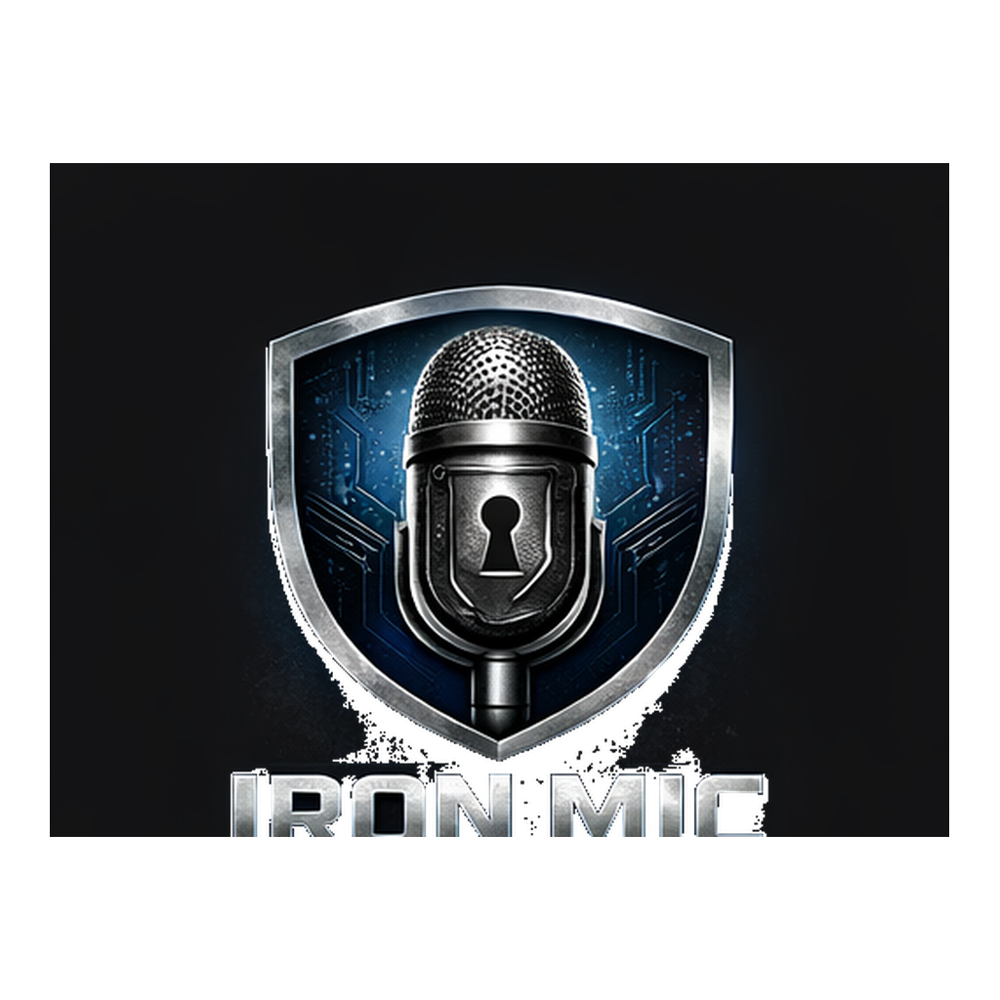

<p align="center">
  
</p>

<h1 align="center">IronMic</h1>

<p align="center">
  <strong>Fully-local enterprise voice AI.</strong> Speak, transcribe, polish, listen back — all on-device. Zero network. Zero telemetry.
</p>

<p align="center">
  <a href="SECURITY.md">Security</a> &middot;
  <a href="AUDIT.md">Security Audit</a> &middot;
  <a href="#features">Features</a> &middot;
  <a href="#quick-start">Quick Start</a> &middot;
  <a href="LICENSE">MIT License</a>
</p>

---

IronMic captures your voice, transcribes it with Whisper, optionally polishes it with a local LLM, and copies the result to your clipboard or saves it as a rich-text note. A built-in TTS engine can read your dictations back to you. Everything runs entirely on your machine — no audio or text ever leaves the device.

---

## Features

### Core Dictation
- **Voice-to-clipboard** — Press a global hotkey, speak, press again. Polished text lands in your clipboard, ready to paste anywhere.
- **Voice-to-note** — Dictate directly into a rich text editor (TipTap/ProseMirror) with formatting, headings, lists, code blocks, and more.
- **Whisper large-v3-turbo** — State-of-the-art local speech recognition with GPU acceleration (Metal on macOS).
- **LLM text cleanup** — A local Mistral 7B model removes filler words, fixes grammar, and preserves your meaning. Toggleable per-entry.
- **Custom dictionary** — Add domain-specific terms, names, and jargon to improve transcription accuracy.

### Text-to-Speech Read-Back
- **Kokoro 82M TTS** — Hear your dictations read back through a local neural voice engine.
- **15 English voices** — American and British accents, male and female. Preview and switch in Settings.
- **Speed control** — 0.5x to 2.0x playback speed.
- **Word-level highlighting** — Words highlight in sync as they're spoken (karaoke-style).
- **Auto read-back** — Optionally read text aloud automatically after dictation completes.

### AI Assistant
- **Built-in AI chat** — Wrapper around GitHub Copilot CLI and Claude Code CLI.
- **Context-aware** — Ask questions, refine text, brainstorm — powered by your existing AI subscriptions.
- **Streaming responses** — Real-time token-by-token output.
- **Privacy-first** — The AI feature is off by default. When enabled, it uses your own CLI tools and credentials.

### Organization & Search
- **Timeline view** — Scrollable card feed of all dictations, newest first.
- **Full-text search** — Instant search across all transcriptions (SQLite FTS5).
- **Tags** — Categorize entries with custom tags.
- **Pin & archive** — Pin important entries to the top, archive old ones.
- **Raw vs. polished toggle** — Switch between original transcript and LLM-cleaned version on any entry.
- **Auto-cleanup** — Configure automatic deletion of entries older than N days.

### Model Management
- **In-app downloads** — Download Whisper, LLM, and TTS models directly from Settings.
- **Multiple Whisper sizes** — Switch between tiny, base, small, medium, and large models.
- **GPU acceleration** — Detect and enable Metal (macOS) or CUDA for faster inference.
- **Progress tracking** — Download progress bars with percentage indicators.

### Design & Customization
- **Dark / Light / System theme** — Full theme support with auto mode that follows your OS preference.
- **Configurable hotkey** — Visual key recorder with conflict detection.
- **Rich text editor** — Bold, italic, headings, lists, blockquotes, code, highlights, and more.
- **Enterprise design system** — Clean, professional UI built on Inter font with the IronMic blue accent.

---

## Architecture

```
Electron UI ← IPC (contextBridge) → Rust Core (napi-rs)
                                      ├── Audio capture (cpal)
                                      ├── Whisper.cpp (speech-to-text)
                                      ├── llama.cpp (text cleanup)
                                      ├── Kokoro ONNX (text-to-speech)
                                      ├── Audio playback (cpal)
                                      ├── SQLite (storage + FTS5)
                                      └── Clipboard (arboard)
```

| Layer | Tech | Purpose |
|-------|------|---------|
| UI | Electron + React 18 + Tailwind CSS + Zustand | Desktop shell, component UI, state management |
| Editor | TipTap (ProseMirror) | Rich text editing |
| Bridge | napi-rs (N-API) | Typed Rust ↔ Node.js communication |
| Audio | cpal | Cross-platform mic input and speaker output |
| STT | whisper-rs (whisper.cpp) | Local speech-to-text |
| LLM | llama-cpp-rs (llama.cpp) | Local text cleanup |
| TTS | ort (ONNX Runtime) + Kokoro 82M | Local neural text-to-speech |
| Storage | rusqlite (SQLite + FTS5) | Entries, settings, dictionary |
| Clipboard | arboard | Cross-platform clipboard |

---

## Prerequisites

- **Rust** stable (1.88+) + cargo
- **Node.js** 20+ + npm
- **CMake** (for whisper.cpp / llama.cpp compilation)
- **espeak-ng** (for TTS phonemization): `brew install espeak-ng`
- Platform-specific:
  - **macOS**: Xcode Command Line Tools
  - **Windows**: Visual Studio Build Tools (C++ workload)
  - **Linux**: `build-essential`, `libasound2-dev`, `libsqlite3-dev`

## Quick Start

```bash
# Clone
git clone https://github.com/greenpioneersolutions/IronMic.git
cd IronMic

# One-command dev mode (builds Rust, installs deps, launches everything)
./scripts/dev.sh
```

The dev script:
1. Builds the Rust native addon with Metal GPU + TTS support
2. Installs npm dependencies (if needed)
3. Compiles Electron main & preload TypeScript
4. Launches Vite dev server + Electron concurrently

### Manual Setup

```bash
# Build Rust core
cd rust-core
cargo build --release --features metal,tts
cp target/release/libironmic_core.dylib ironmic-core.node
cd ..

# Install and run frontend
cd electron-app
npm install
npx concurrently "npx vite" "sleep 3 && npx electron ."
```

### Download Models

Models are downloaded through the Settings UI inside the app:
- **Whisper large-v3-turbo** (~1.5 GB) — speech recognition
- **Mistral 7B Instruct Q4** (~4.4 GB) — text cleanup
- **Kokoro 82M** (~163 MB + ~7.5 MB voices) — text-to-speech

## Running Tests

```bash
# Rust tests (22 tests)
cd rust-core
cargo test --no-default-features

# Frontend build verification
cd electron-app
npx vite build
```

---

## Privacy & Security

These are hard architectural constraints, not policies:

1. **No network calls.** All outbound requests blocked. Model downloads are the only exception, triggered explicitly by you.
2. **Audio never hits disk.** Mic input lives in memory only. Buffers explicitly zeroed after use.
3. **No telemetry.** No analytics, crash reporting, or usage tracking.
4. **Local-only storage.** Single SQLite file in your app data directory.
5. **Sandboxed renderer.** `contextIsolation: true`, `nodeIntegration: false`, `sandbox: true`.
6. **Model download integrity.** SHA-256 verified, HTTPS-only, domain-validated.

For the full security model, threat analysis, and configuration guide, see **[SECURITY.md](SECURITY.md)**.

---

## Project Structure

```
IronMic/
├── rust-core/                 # Rust native addon (napi-rs)
│   ├── src/
│   │   ├── audio/             # Mic capture + resampling
│   │   ├── transcription/     # Whisper integration + dictionary
│   │   ├── llm/               # LLM text cleanup + prompts
│   │   ├── tts/               # Kokoro TTS + playback + timestamps
│   │   ├── storage/           # SQLite CRUD + FTS5 + migrations
│   │   ├── clipboard/         # Clipboard management
│   │   ├── hotkey/            # Pipeline state machine
│   │   ├── error.rs           # Unified error types
│   │   └── lib.rs             # N-API exports (~50 functions)
│   └── models/                # Downloaded model weights (gitignored)
├── electron-app/              # Electron + React frontend
│   └── src/
│       ├── main/              # Electron main process + IPC handlers
│       │   └── ai/            # AI chat adapter (Copilot/Claude CLI)
│       ├── preload/           # Typed contextBridge API
│       └── renderer/          # React UI
│           ├── components/    # 25+ components
│           ├── stores/        # Zustand state (5 stores)
│           └── hooks/         # Custom hooks (bridge, theme, search)
├── scripts/
│   └── dev.sh                 # One-command dev launcher
└── CLAUDE.md                  # Architecture documentation
```

## Feature Flags (Rust)

The Rust core uses Cargo feature flags to conditionally compile heavy dependencies:

| Feature | Dependencies | Purpose |
|---------|-------------|---------|
| `napi-export` (default) | — | Enables N-API function exports |
| `whisper` | whisper-rs | Speech-to-text |
| `metal` | whisper + whisper-rs/metal | GPU acceleration on macOS |
| `llm` | llama_cpp_rs | LLM text cleanup |
| `tts` | ort, ndarray | Kokoro TTS inference |

Tests run with `--no-default-features` to avoid N-API linker dependencies.

---

## Security Audit

We publish a comprehensive, code-referenced self-audit that verifies every security claim we make. It points to exact files, line numbers, and code snippets — so you can confirm everything yourself.

**[Read the full audit](AUDIT.md)**

The audit covers: network isolation, audio zero-on-drop, model download integrity (SHA-256 + HTTPS + domain validation), HuggingFace source verification, Electron sandbox configuration, IPC validation, environment variable scoping, SQL injection protection, XSS prevention, and more.

We encourage you to verify our claims. If you don't trust our self-audit, please engage an independent security professional to review the codebase. We welcome it.

---

## License

MIT — see [LICENSE](LICENSE).
